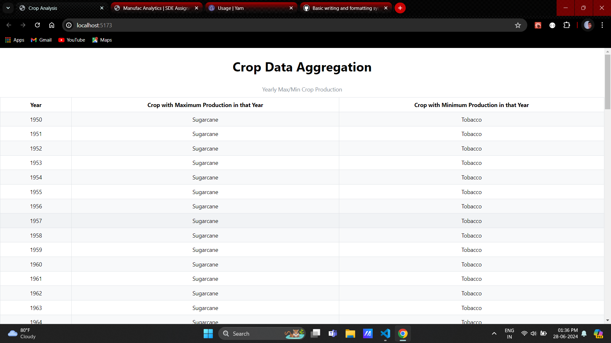
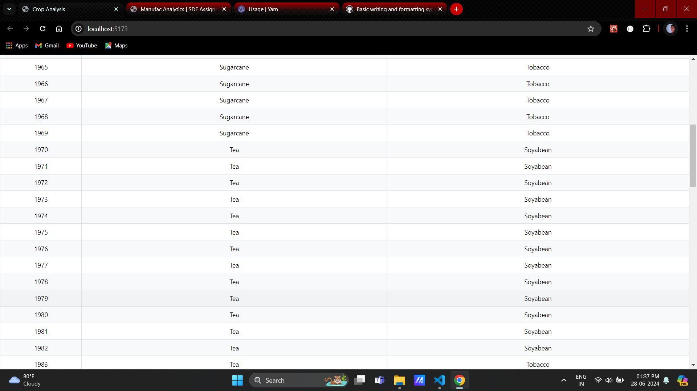
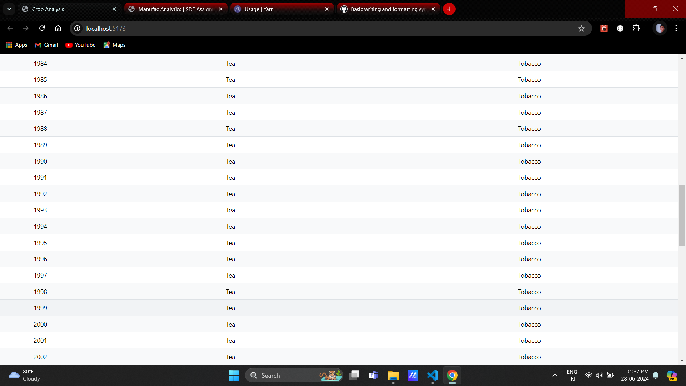
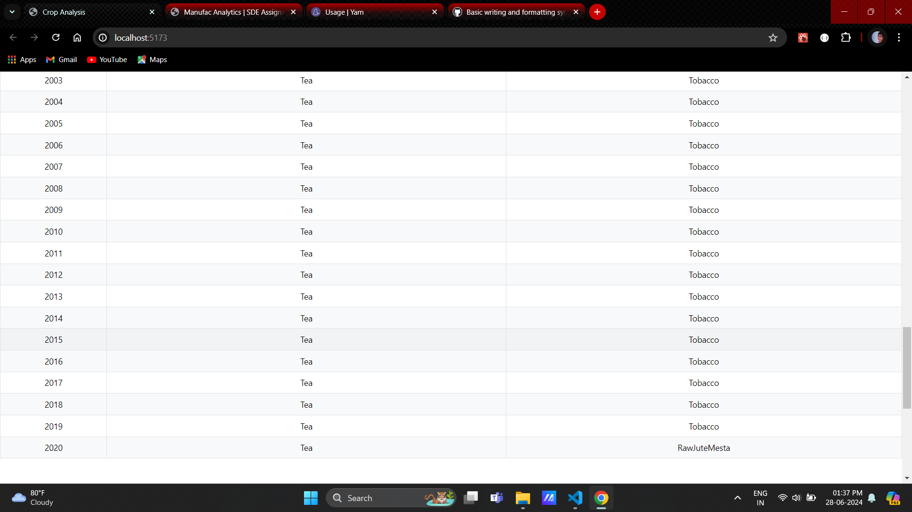
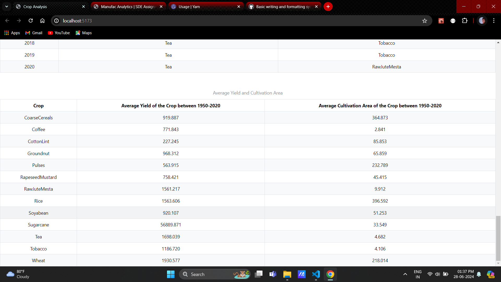

To run this project, you can follow these steps:

1. Open a terminal or command prompt and navigate to the project's directory using the `cd` command.

2. To install the necessary dependencies execute the command `yarn install`.

3. To run the project execute the command `yarn dev`.

4. After running the project, you will see a link on the terminal and click on that link holding `Ctrl` inorder to see the output in the web browser.

### Screenshots

